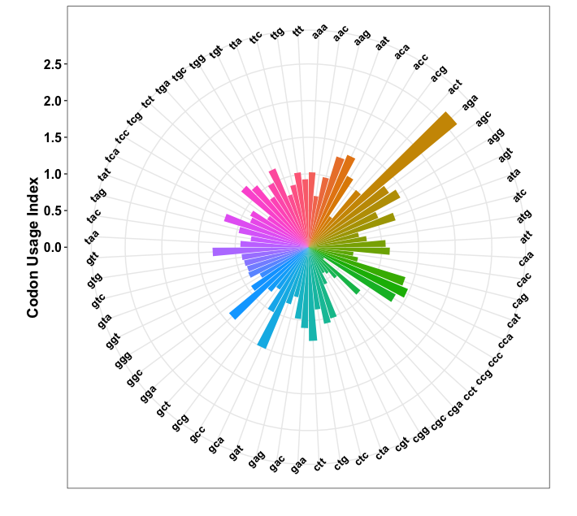
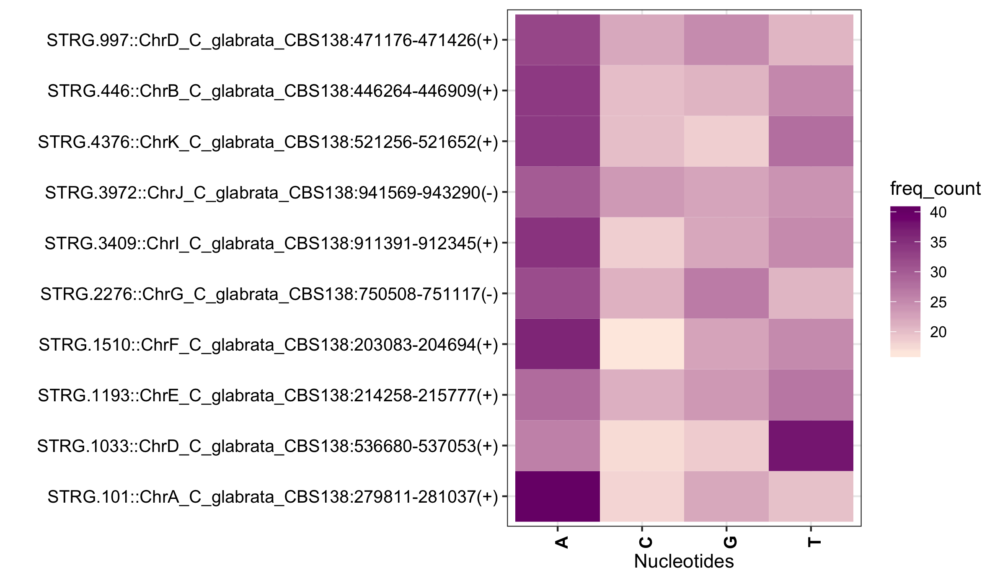
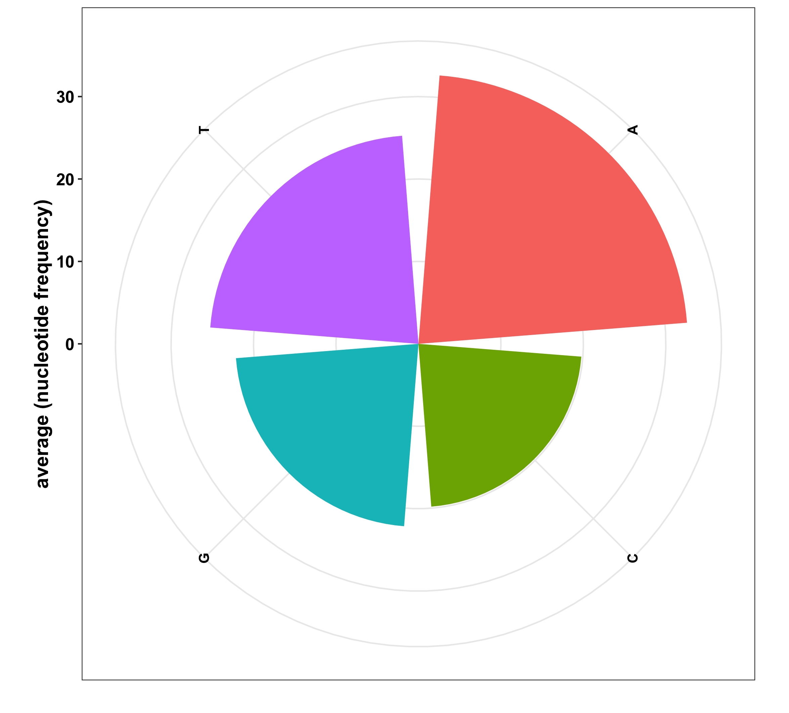

## Codon bias

This function allows you to map the codon bias in given multi-fasta file.
The codon bias calculation can be done on:
1.  RSCU: Relative Synonymous Codon Usage, default
1.   eff: codon counts
1.  freq: codon relative frequencies

You can summarise the occurrence of codon based on mean or median values.

#### Run this function as:


```r
source("get_codon_usage_index.R")
multifasta_file  <-  "SequenceSample.fa"
get_codon_usage_index(multifasta_file, summariseBy = 1,condon_usage_by = "freq", mylist=NULL,outfile = "sample")
```

#### Output of the function is pie-chart displaying distribution of codons in given multifasta file.



## Amino acid or nucleotide frequency distirbution
Frequency of nucleotides or amino acids can be determined from multi-fasta DNA or protein file.
Frequency can also be calculated for specific genelist by specifying mylist or the enitre multi-fasta file. Subset of the fasta file will be generated for given list from reference multi-fasta file. Further the function checks first and alerts if the uploaded file is protein or dna. 
#### Run this function as:


```r
source("get_freq_distribution.R")
multifasta_file  <-  "SequenceSample.fa"
get_freq_distribution(multifasta_file = multifasta_file, mylist = NULL, outfile = "SequenceSample")
```

### 

The function gives three out put

1. subset of the multi-fasta file based on the uploaded list
1. Average frequency file
1. Plot of gene wise frequency

1. Plot of average frequency



## Remove first n nucleotides or amino acids

This function allows to remove first n nucleotides in given nucleic acid or protein multi-fasta file

#### Run this function as:


```r
source("remove_first_n_nucleotides.R")
multifasta_file  <-  "SequenceSample.fa"
remove_first_n_nucleotides(multifasta_file,remove_first_n = 1,outfile = "sample")
```

## Get first n codons

This function allows to extract first n codons in given nucleic acid or protein multi-fasta file

#### Run this function as:


```r
source("get_first_n_codons.R")
multifasta_file  <-  "SequenceSample.fa"
get_first_n_codons(fasta_file=multifasta_file, word_size=3, number_of_codons=3,output_name="sample")
```

#### output of the function

gene                                                 1     2     3   
---------------------------------------------------  ----  ----  ----
STRG.101::ChrA_C_glabrata_CBS138:279811-281037(+)    ACG   AGA   AAT 
STRG.1033::ChrD_C_glabrata_CBS138:536680-537053(+)   CTG   CGA   TGA 
STRG.1193::ChrE_C_glabrata_CBS138:214258-215777(+)   AAG   GAT   TAA 
STRG.1510::ChrF_C_glabrata_CBS138:203083-204694(+)   GAA   GAG   GCG 


